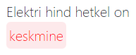
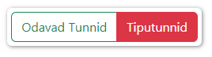
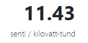
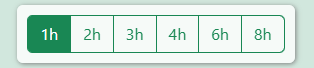
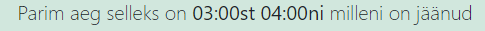
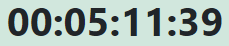

#  **Try out this React project**

- Clone the repository using Git, open a terminal or command prompt and navigate to the directory where you want to store the project. Then, run the command `git clone https://github.com/QQrban/elektrikell`.
- Once you have the project on your local machine, navigate to the project directory using a terminal or command prompt.

    Run the command `npm install` to install all of the project's dependencies.
- After the dependencies have been installed, run the command `npm start` to start the development server.

# Introduction to the application

Using the API from the [elering.ee](https://dashboard.elering.ee/assets/api-doc.html) website, this application displays the current electricity price in real-time. 

This website is an analogue of the Estonian website [elektrikell.ee](https://elektrikell.ee), created by a student of the "Frontend developer intensive course for beginners based on React.js" by Gamma Intelligence OÜ company.

# How to use this application?

### On the main page, you can see the current time and electricity price displayed on a graph with a Red Line. 

 

### In the top left corner, you can see an approximate estimation of the current electricity price

 

  

### This feature has three options: kõrge if the electricity price is equal to or above 15 cents, keskmine if the price is equal to or above 10 cents, and madal if the price is below 10 cents.

 

#### Between these two buttons &nbsp;  &nbsp; located at the top of the page, you can choose which data you want to view. The Odavad Tunnid button shows the cheapest hours for energy consumption, which are marked with green columns. The Tiputunnid button shows the most expensive hours for energy consumption, which are marked with red columns.

 

#### These numbers &nbsp;  &nbsp; display the price of electricity in **cents(€) per kilowatt-hour** in real-time. Typically, the price is significantly lower at night than during the day. The highest price is observed in the mornings (7:00-10:00) and evenings (19:00-21:00).

 

#### At the bottom of the website, there are buttons &nbsp;  &nbsp;  that allow you to see the hours with the cheapest electricity if you consume it for 2, 3, 4, 6 or 8 hours. Just **click** on them and you will see how the graph changes accordingly.

 

#### The row below &nbsp;  &nbsp; shows the hours during which the cheapest electricity is available, and it changes when the button with the number of hours is clicked.

 

#### In addition, there is also a timer &nbsp;  &nbsp; that shows the remaining hours until the cheap energy mark.

 

 

# Additional information:

### The application was built using React and various libraries. `Moment` is used for working with dates and `Bootstrap` for the UI. The chart is created using `Recharts`. Navigation on the site is made using `React-Router-Dom`. The application also utilizes `React-Redux` for managing data state and the user interface.